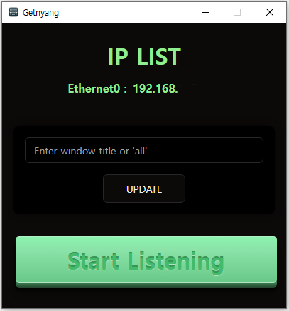
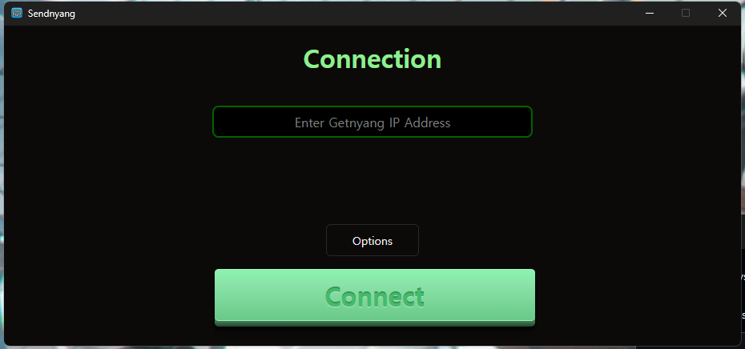
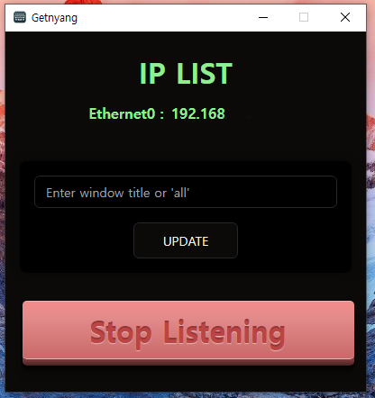
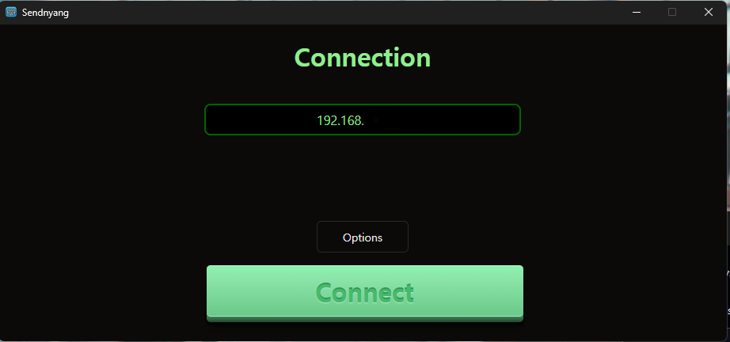

# Keyshare Utility
- - -
입력 PC에서 다른 PC로 키보드, 마우스 입력을 실시간 공유하는 프로그램입니다.


## Installation
- - -
### [Download Latest Version](https://github.com/devsepnine/keyshare/releases)

## Demo
- - -
[](https://youtu.be/Kfa9ge3YNx8?t=0s)
## Usage
- - -
```
입력을 공유 받을 PC에 Getnyang을 설치 후 실행합니다.
```


```
공유를 시작할 PC에서 Sendnyang을 설치 후 실행합니다.
```


```
옵션에서 키보드에서 보내고자 하는 키들을 선택하거나 Reset을 눌러 초기화 진행이 가능합니다.
기본 옵션은 아무것도 선택되어 있지않으며 모든 키를 전송합니다.
마우스 정보의 기본값은 미전송으로 설정되어있습니다.
```

```
모든 준비가 완료되었습니다. 공유 PC에서 Start Listening을 눌러 연결을 받을 수 있도록 준비합니다.
```


- 공유를 진행할 PC에서 전달받을 PC의 IP를 입력 후 Connect를 눌러 연결합니다.
